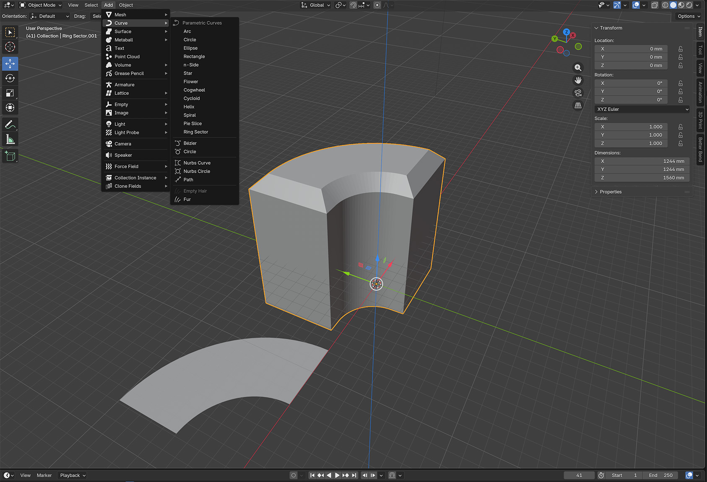

# Parametric Curves



Parametric Curves is a small Blender extension that adds persistent curve
primitives at the top of Blender's native Curve add menu:

`Add > Curve`

Each primitive creates a Curve object with a reusable `PS_` Geometry Nodes
modifier. The modifier exposes the construction parameters directly, while the
extension keeps the Curve datablock regenerated from those values.

Included primitives:

- Arc
- Circle
- Ellipse
- Rectangle
- n-Side
- Star
- Flower
- Cogwheel
- Cycloid
- Helix
- Spiral
- Pie Slice
- Ring Sector

This is intentionally lightweight: no sidebar panel, no external `.blend`
assets, and no required Geometry Nodes editor workflow.

For Rectangle, n-Side, Star, Cogwheel, Pie Slice, and Ring Sector, set
`Corner Radius` to `0` for sharp corners or increase it for rounded corners.

## Ring Sector Inner Angle Offset

`Ring Sector` includes an `Inner Angle Offset` parameter for radial cloning
workflows. Leave it at `0°` for a normal annular sector whose side edges point
toward the center. Positive values move the inner arc's start and end angles
inward from the outer arc. Negative values move them outward.

For example, with a radial cloner set to 5 copies over 360 degrees, use a Ring
Sector sweep of `72°`, then adjust `Inner Angle Offset` visually. After it
looks close, type the exact angle you want.

## Install

Download or build the extension zip, then install it in Blender:

1. Open Blender.
2. Go to `Edit > Preferences > Extensions`.
3. Use the menu in the top-right of the Extensions panel and choose
   `Install from Disk`.
4. Select `parametric_curves-0.1.0.zip`.
5. Enable `Parametric Curves` if Blender does not enable it automatically.

After installation, use:

`Add > Curve`

## Build from source

From this repository:

```bash
/Applications/Blender.app/Contents/MacOS/Blender --background --command extension build --source-dir . --output-dir .
```

This creates `parametric_curves-0.1.0.zip`.

To install the built package into Blender's default user extension repository
from the command line:

```bash
/Applications/Blender.app/Contents/MacOS/Blender --background --command extension install-file -r user_default -e ./parametric_curves-0.1.0.zip
```

Restart Blender after installing or replacing the package.

## License

MIT
